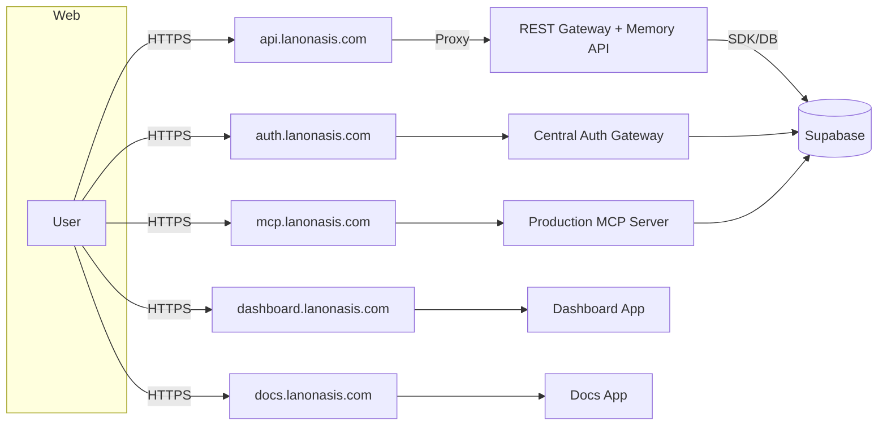

The LanOnasis platform is intentionally split into independently deployable services with strict boundaries. REST and MCP are distinct entry points by design.

## High-level map

## Domains → Services → Repo paths

| Domain | Primary purpose | Backing app/service (monorepo path) | Notes |
| --- | --- | --- | --- |
| `api.lanonasis.com` | REST gateway, Memory API | `onasis-core` (gateway), Memory endpoints consumed by `apps/lanonasis-maas` | Public REST entry; proxied via Netlify. See integration examples. |
| `auth.lanonasis.com` | Central Auth Gateway | `onasis-core` (auth gateway) | Canonical OAuth (Device Flow + PKCE). Clients should prefer OAuth over raw keys. |
| `mcp.lanonasis.com` | Production MCP server (SSE/HTTP/WebSocket) | `apps/mcp-core` or `apps/mcp-lanonasis` (deployment target) | Official MCP endpoint and tool registry. |
| `docs.lanonasis.com` | Documentation website | `apps/docs-lanonasis` | This site. |
| `dashboard.lanonasis.com` | Admin/Operator dashboard | `apps/dashboard` | Authenticated operator interface. |
| Memory Suite (MaaS) | Memory Service + SDK/CLI | `apps/lanonasis-maas`, SDK in external package, CLI tooling | Exposed via REST and MCP tools. |

> For operators: external gateway/proxy infra details are referenced in internal docs and deployment manifests. This page is focused on the public-facing map and cross-links.

## Why REST and MCP are separate

- REST (`api.lanonasis.com`) provides stable HTTP endpoints for products and third-party integrators.
- MCP (`mcp.lanonasis.com`) exposes a tool-driven protocol suited for agents and IDEs, with long-lived connections and server-sent events.

## Where to go next

- Central Auth (OAuth, flows, client guidance): see [Auth → Central Auth Gateway](../auth/central-auth-gateway.md)
- MCP (endpoints, tools, IDE configs): see [MCP → Production Server](../mcp/production-server.md) and [MCP → IDE Integration](../mcp/ide-integration.md)
- Memory Suite (REST, SDK, CLI): see [Memory → Overview](../memory/overview.md)
- Vendor API Keys (storage, rotation, auditing): see [Keys → Vendor Key Management](../keys/vendor-key-management.md)
- Changes & migrations across releases: see [Changelog & Migration](../changes/index.md)

